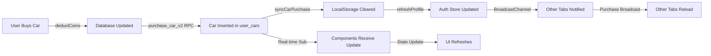

# Cross-Platform Purchase Sync Fix

## Problem
Users were seeing "You need to purchase a car/property" prompts even after buying vehicles or homes. This happened across web, mobile PWA, and multiple browser tabs due to:

1. **No real-time subscriptions** - UI didn't automatically update when purchases happened in database
2. **Cache invalidation issues** - Old data stored in LocalStorage wasn't cleared after purchases
3. **Profile sync lag** - `user_profiles` table wasn't updated with new owned vehicles/properties
4. **Multi-tab sync failures** - Purchases in one tab didn't notify other open tabs
5. **Incomplete refresh** - After purchase, components only did one manual fetch without subscribing to changes

## Solution

### 1. New `purchaseSync.ts` Utility Module
**Location**: `src/lib/purchaseSync.ts`

Provides four key functions:

#### `syncCarPurchase(userId: string)`
- Clears all car-related LocalStorage caches
- Fetches fresh user_cars from database
- Updates user_profiles with owned_vehicle_ids and active_vehicle
- Refreshes auth store profile
- Broadcasts purchase event to other browser tabs

#### `syncPropertyPurchase(userId: string)`
- Clears all property-related LocalStorage caches
- Fetches fresh properties from database
- Updates user_profiles with owned_property_ids and active_home
- Refreshes auth store profile
- Broadcasts purchase event to other browser tabs

#### `subscribeToUserCars(userId: string, onUpdate: callback)`
- Real-time Supabase subscription to user_cars table
- Auto-refetches all cars when any change is detected
- Executes callback with fresh data
- Must be unsubscribed in cleanup

#### `subscribeToProperties(userId: string, onUpdate: callback)`
- Real-time Supabase subscription to properties table
- Auto-refetches all properties when any change is detected
- Executes callback with fresh data
- Must be unsubscribed in cleanup

#### `listenForPurchaseBroadcasts(onPurchase: callback)`
- Uses BroadcastChannel API for cross-tab communication
- Gracefully degrades on browsers that don't support it (e.g., private browsing)
- Triggers callback when purchase events detected from other tabs

### 2. CarDealershipPage Updates
**Location**: `src/pages/game/CarDealershipPage.tsx`

**Changes**:
- Import `syncCarPurchase`, `subscribeToUserCars`, `listenForPurchaseBroadcasts`
- Enhanced main `useEffect` now:
  - Sets up real-time subscription to user_cars table
  - Listens for purchase broadcasts from other tabs
  - Properly cleans up subscriptions on unmount
- Purchase handler now:
  - Calls `syncCarPurchase()` after successful purchase
  - This replaces the old manual refresh logic
  - Ensures all caches are cleared immediately

### 3. GaragePage Updates
**Location**: `src/pages/game/GaragePage.tsx`

**Changes**:
- Import sync utilities
- Main `useEffect` now:
  - Subscribes to real-time user_cars changes
  - Listens for broadcast events from other tabs
  - Cleans up all subscriptions properly

### 4. TrollsTownPage Updates
**Location**: `src/pages/TrollsTownPage.tsx`

**Changes**:
- Import sync utilities
- Main data loading `useEffect` now:
  - Subscribes to real-time properties changes
  - Listens for broadcast events from other tabs
  - Automatically refreshes owned properties when detected
- Purchase handler calls `syncPropertyPurchase()` after successful sale

## How It Works

### Purchase Flow (After Fix)



### Real-Time Updates

1. **Same Tab/Window**:
   - Real-time subscription detects car_id change in user_cars
   - Component state updates automatically
   - No page reload needed

2. **Different Tab/Window**:
   - BroadcastChannel API sends message to all tabs of same origin
   - Other tabs receive `type: 'car_purchased'` or `type: 'property_purchased'`
   - Tabs re-fetch data to stay in sync

3. **Mobile PWA**:
   - Same real-time subscription mechanism
   - LocalStorage cleared ensures no stale data
   - Profile refresh keeps Zustand store current

## Benefits

✅ **Instant UI Updates** - Components reflect purchases immediately via real-time subs
✅ **Cross-Tab Sync** - All browser tabs stay synchronized
✅ **Cache Safety** - LocalStorage properly invalidated after purchases
✅ **PWA Compatibility** - Works on mobile web, desktop web, PWA
✅ **Offline Graceful** - BroadcastChannel degrades gracefully if unavailable
✅ **Profile Consistency** - user_profiles always matches user_cars/properties

## Testing Checklist

- [ ] Open dealership, purchase car, see it immediately in garage
- [ ] Purchase car in one tab, open garage in another tab → car appears
- [ ] Purchase property in TrollsTown, navigate to garage → property shows
- [ ] Mobile PWA: Purchase car, reload app → car still owned
- [ ] Check browser console: No "need to purchase" messages after buying
- [ ] Test on both Chrome and Firefox for real-time support
- [ ] Verify old vehicles/properties no longer in ownership queries

## Technical Details

### Supabase Subscriptions
- Uses `postgres_changes` to watch user_cars and properties tables
- Automatically refetches on INSERT, UPDATE, or DELETE
- Filters by user_id for security

### BroadcastChannel API
- Supported on all modern browsers except Safari (gracefully degrades)
- Uses channel name `trollcity_purchases` for all purchase events
- Messages include: type, userId, timestamp, ownedIds/activeVehicleId

### LocalStorage Keys Affected
- `trollcity_car_${userId}` - Active car config (cleared)
- `trollcity_owned_vehicles_${userId}` - Owned vehicle IDs (cleared)
- `trollcity_car_insurance_${userId}` - Insurance status (cleared)
- `trollcity_owned_properties_${userId}` - Owned property IDs (cleared)
- `trollcity_active_property_${userId}` - Active property (cleared)
- `trollcity_property_insurance_${userId}` - Property insurance (cleared)

### Database Updates
- `user_cars` table: New row inserted via `purchase_car_v2()` RPC
- `user_profiles`: `owned_vehicle_ids` and `active_vehicle` updated
- `properties` table: owner_user_id changed via `is_listed=false` removal
- `user_profiles`: `owned_property_ids` and `active_home` updated

## Future Enhancements

1. **Offline Queue**: Store failed purchases in IndexedDB, sync when online
2. **Conflict Resolution**: Handle simultaneous purchases of same item
3. **Analytics**: Track purchase-to-display latency
4. **Performance**: Batch real-time updates if database is highly active
5. **PWA Sync**: Use Service Workers to sync across PWA instances

## Debugging

If purchases still don't sync:

1. Check browser DevTools Console for subscription errors
2. Verify Supabase session is authenticated
3. Confirm Row-Level Security (RLS) policies allow SELECT on user_cars/properties
4. Check network tab for real-time payload delivery
5. Verify user_id matches across auth and database

For cross-tab sync:
```javascript
// In browser console, check if BroadcastChannel works:
new BroadcastChannel('test');  // Should not throw
```
